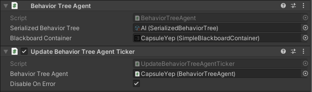

# Behavior Tree

Behavior Tree for Unity is an implementation of a classical behavior tree for Unity engine.
Behavior trees allow you to easily set up a behavior switcher based on different conditions. 
Usually, it's used for game AI.

## Installation

This repo is a regular Unity package. You can install it as your project dependency.
More here: https://docs.unity3d.com/Manual/upm-dependencies.html.

## Usage

### Core types

- [TreeRoot] - main class for a behavior tree. All the interactions with a behavior tree are done through this.
- [Status] - enum with all the possible results of a behavior tick. 
- [Behavior] - base class for all the behaviors of a behavior tree.
  - [Leaf] - [Behavior] that doesn't have children.
    - [Action] - [Leaf] that does something and returns a result of its action.
    - [Condition] - [Leaf] that doesn't do anything but computes a condition and returns its result.
    - [StatusBehavior] - [Leaf] that just returns a [Status]. Usually, it's used for testing.
  - [Decorator] - [Behavior] that has one child.
  - [Composite] - [Behavior] that has multiple children.

### Setup

#### With regular c# code

[Leaf], [Decorator] and [Composite] have different create methods. 
You should use them accordingly to a behavior type. 
Setup methods of [Decorator] and [Composite] require created children. 
So, you have to create a tree in a backward manner.
After the root behavior is created, you need to create a [TreeRoot]. Its constructor requires a root behavior and a blackboard.

##### *Example*

```
var objectName = new BlackboardPropertyName("Player");
var animatorName = new BlackboardPropertyName("Animator");
const string isPlayerDeadProperty = "isPlayerDead";

SetAnimatorBoolProperty setPlayerAlive = Leaf.Create<SetAnimatorBoolProperty, BlackboardPropertyName, string, bool>(animatorName, isPlayerDeadProperty, false);
IsObjectAlive isObjectAlive = Leaf.Create<IsObjectAlive, BlackboardPropertyName>(objectName);
Inverter inverter = Decorator.Create<Inverter>(isObjectAlive);
SetAnimatorBoolProperty setPlayerDead = Leaf.Create<SetAnimatorBoolProperty, BlackboardPropertyName, string, bool>(animatorName, isPlayerDeadProperty, true);
Sequence sequence = Composite.Create<Sequence>(new Behavior[] { setPlayerAlive, inverter, setPlayerDead });

Blackboard blackboard = GetBlackboard();
var treeRoot = new TreeRoot(blackboard, sequence);
```

#### With [TreeBuilder]

Backward manner may be complicated for both people and code. 
That's why this library has a special tool name [TreeBuilder] that allows you to create a behavior tree 
in a forward manner and without manual child linking.

Behaviors are added into a tree builder with methods `AddLeaf()`, `AddDecorator()` and `AddComposite()`. 
After you added a behavior and all its children, you have to call the method `Complete()`.
After all behaviors are added, you need to call `Build()` to get a new created behavior tree.

A [TreeBuilder] may be set up only once but it may produce multiple behavior trees - 
every call of `Build()` creates a new identical behavior tree.

##### *Example*

```
var objectName = new BlackboardPropertyName("Player");
var animatorName = new BlackboardPropertyName("Animator");
const string isPlayerDeadProperty = "isPlayerDead";

Blackboard blackboard = GetBlackboard();

var treeBuilder = new TreeBuilder();
treeBuilder.AddComposite<Sequence>()
	.AddLeaf<SetAnimatorBoolProperty, BlackboardPropertyName, string, bool>(animatorName, isPlayerDeadProperty, false).Complete()
	.AddDecorator<Inverter>()
		.AddLeaf<IsObjectAlive, BlackboardPropertyName>(objectName).Complete()
	.Complete()
	.AddLeaf<SetAnimatorBoolProperty, BlackboardPropertyName, string, bool>(animatorName, isPlayerDeadProperty, true).Complete()
.Complete();

TreeRoot treeRoot = treeBuilder.Build(blackboard);
```

#### With [SerializedBehaviorTree]

The library supports a default Unity serialization based on scriptable objects. 
Also, this method provides a graphical interface to create and edit behavior trees.

To create a serialized behavior tree, 
you need to click `Assets/Create/Behavior Tree/Serialized Behavior Tree` in the Unity interface. 
After that you need to open the created serialized behavior tree 
or open a window `Window/Behavior Tree/Behavior Tree Window` and select the created asset.
In the opened window, you can set up a behavior tree. It's automatically saved in a Unity serialized asset.

The type of the serialized behavior tree asset is [SerializedBehaviorTree]. 
You can call a method `CreateTree()` on a valid asset to get a new created behavior tree. 
You can call this method multiple times and get a new identical behavior tree every time.

##### *Example*


```
SerializedBehaviorTree serializedBehaviorTree = GetSerializedBehaviorTree();
Blackboard blackboard = GetBlackboard();

TreeRoot treeRoot = serializedBehaviorTree.CreateTree(blackboard);
```

#### With [BehaviorTreeAgent]

[BehaviorTreeAgent] is a Unity component that wraps all the logic around [TreeRoot]. 
You need to add it to any game object and set links to a serialized behavior tree and a blackboard component.

##### *Example*


### Ticks

[TreeRoot] doesn't do anything by itself. You need to call `TreeRoot.Tick()` to make it do something.
But you must call `TreeRoot.Initialize()` before a first tick and `TreeRoot.Dispose()` after a last tick.
If you use a [BehaviorTreeAgent], you don't have an access to the private [TreeRoot] 
and you need to call `BehaviorTreeAgent.Tick()` or use one of [BehaviorTreeAgentTickers].
They are Unity components and automatically call `BehaviorTreeAgent.Tick()` and other methods in different loops.

##### *Example*



#### Statuses

`TreeRoot.Tick()` returns a new [Status] of a behavior tree. 
Every [Behavior] also returns a new [Status] in its tick. 
And status of a tree root is a status of its root behavior. 
Here's a description of possible statuses:
- Idle - a behavior (a tree) was never ticked.
- Success - a tick of a behavior (a tree) was finished successfully.
- Running - a tick of a behavior (a tree) did something but it's not finished and it's needed to tick again. 
Usually, it's returned by behaviors that have continuous executes.
- Failure - a tick of a behavior (a tree) was finished unsuccessfully.
- Error - a tick of a behavior (a tree) had an error that prevented it from a correct execution.
- Abort - an execution of a behavior (a tree) was aborted and not ticked since then. 
It's possible to abort a behavior (a tree) in Running status only. 
To abort a behavior tree, call `TreeRoot.Abort()`.

### Runtime behavior tree state

You can see statuses of all runtime behaviors of a behavior tree if it's created in a [BehaviorTreeAgent].
Simply open a window `Window/Behavior Tree/Behavior Tree Window` and select a game object with a [BehaviorTreeAgent].
if you have several agents on a single game object, you can choose a needed one with a drop-down selector.
Statuses are shown with different colors.

#### Color definition

- Black - Idle
- Green - Success
- Yellow - Running
- Red - Failure
- Cyan - Error
- White - Abort

##### *Example*


### Custom behaviors

You can add your custom behaviors. 
You need to inherit one of these classes: [Action], [Condition], [Decorator] or [Composite].
You mustn't add a constructor to your custom behavior. They must have only a default constructor.
To get a constructor functionality, implement an [ISetupable] interface.
After that you already can use your behavior in code. 
But to serialize it, you need to inherit one of these classes: 
[SerializedAction], [SerializedCondition], [SerializedDecorator] or [SerializedComposite].
After that you can already serialize it.

#### [DrawingAttributes]

- [BehaviorInfoAttribute] - add it to a field of a custom behavior, 
and it'll be drawn in a [BehaviorTreeWindow] in runtime mode.
- [NameOverrideAttribute] - add it to a serialized behavior class and set a name of a setup argument. 
For every argument you need to add an instance of the attribute. 
If a serialized argument doesn't have such an attribute, it's drawn with a generic name.
- [SearchGroupAttribute] - add it to a serialized behavior class a set a search group path for the behavior.
It's used by a [BehaviorTreeWindow] in a serialized tree edit mode.

### Debug

This library automatically logs different messages via Unity log. You can control it with defines from [BehaviorTreeDebug]:
BEHAVIOR_TREE_LOG, BEHAVIOR_TREE_WARNING and BEHAVIOR_TREE_ERROR.

[BehaviorTreeWindow]: Editor/EditorWindows/BehaviorTreeWindow.cs
[TreeRoot]: Runtime/Core/TreeRoot.cs
[Status]: Runtime/Core/Status.cs
[Behavior]: Runtime/Core/Behavior.cs
[Leaf]: Runtime/Core/Leaves/Leaf.cs
[Action]: Runtime/Core/Leaves/Actions/Action.cs
[Condition]: Runtime/Core/Leaves/Conditions/Condition.cs
[StatusBehavior]: Runtime/Core/Leaves/StatusBehaviors/StatusBehavior.cs
[Decorator]: Runtime/Core/Decorators/Decorator.cs
[Composite]: Runtime/Core/Composites/Composite.cs
[TreeBuilder]: Runtime/Builder/TreeBuilder.cs
[SerializedBehaviorTree]: Runtime/Serialization/SerializedBehaviorTree.cs
[BehaviorTreeAgent]: Runtime/Components/BehaviorTreeAgent.cs
[BehaviorTreeAgentTickers]: Runtime/Components/BehaviorTreeAgentTickers
[SerializedAction]: Runtime/Serialization/SerializedBehaviors/Leaves/Actions/SerializedAction.cs
[SerializedCondition]: Runtime/Serialization/SerializedBehaviors/Leaves/Conditions/SerializedCondition.cs
[SerializedDecorator]: Runtime/Serialization/SerializedBehaviors/Decorators/SerializedDecorator.cs
[SerializedComposite]: Runtime/Serialization/SerializedBehaviors/Composites/SerializedComposite.cs
[ISetupable]: Runtime/Core/ISetupable.cs
[Status]: Runtime/Core/Status.cs
[DrawingAttributes]: Runtime/DrawingAttributes
[BehaviorInfoAttribute]: Runtime/DrawingAttributes/BehaviorInfoAttribute.cs
[NameOverrideAttribute]: Runtime/DrawingAttributes/NameOverrideAttribute.cs
[SearchGroupAttribute]: Runtime/DrawingAttributes/SearchGroupAttribute.cs
[BehaviorTreeDebug]: Runtime/Debug/BehaviorTreeDebug.cs
